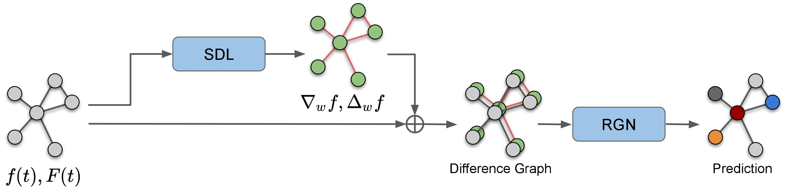

# Physics-aware Difference Graph Networks for Sparsely-Observed Dynamics

This repository is the official PyTorch implementation of "Physics-aware Difference Graph Networks for Sparsely-Observed Dynamics".



Sungyong Seo*, Chuizheng Meng*, Yan Liu, [Physics-aware Difference Graph Networks for Sparsely-Observed Dynamics](https://openreview.net/forum?id=r1gelyrtwH), ICLR 2020.

## Data

Download the requried `data.zip` from [Google Drive](https://drive.google.com/file/d/15cO2P5czgQJMoAW_4jnwiQZXMoo2E3uv/view?usp=sharing). Then,

```bash
cd /path/to/the/root/of/project
mkdir data
mv /path/to/data.zip ./data/
cd data
unzip data.zip
```

## Environment

### Docker (Recommended!)

First follow the official documents of [Docker](https://docs.docker.com/install/linux/docker-ce/ubuntu/) and [nvidia-docker](https://github.com/NVIDIA/nvidia-docker) to install docker with CUDA support.

Use the following commands to build a docker image containing all necessary packages:

```bash
cd docker
bash build_docker.sh
```

This script will also copy the `jupyter_notebook_config.py`, which is the configuration file of Jupyter Notebook, into the docker image. The default password for Jupyter Notebook is `12345`.

Use the following script to create a container from the built image:

```bash
bash rundocker-melady.sh
```

If the project directory is not under your home directory, modify `rundocker-melady.sh` to change the file mapping.

### Manual Installation

```bash
# install python packages
pip install pyyaml tensorboardX geopy networkx tqdm
conda install pytorch==1.1.0 torchvision==0.2.2 cudatoolkit=9.0 -c pytorch
conda install -y matplotlib scipy pandas jupyter scikit-learn geopandas
conda install -y -c conda-forge jupyterlab igl meshplot

# install pytorch_geometric
export PATH=/usr/local/cuda/bin:$PATH
export CPATH=/usr/local/cuda/include:$CPATH
export LD_LIBRARY_PATH=/usr/local/cuda/lib64:$LD_LIBRARY_PATH
pip install --verbose --no-cache-dir torch-scatter==1.2.0
pip install --verbose --no-cache-dir torch-sparse==0.4.0
pip install --verbose --no-cache-dir torch-cluster==1.3.0
pip install --verbose --no-cache-dir torch-spline-conv==1.1.0
pip install torch-geometric==1.1.2

# specify numpy==1.16.2 to avoid loading error (>=1.16.3 may require allow_pickle=True in np.load)
pip install -I numpy==1.16.2 
```

## Run

### Experiments in Section 3.1 "Approximation of Directional Derivatives"

See the Jupyter Notebook `approx-gradient/synthetic-gradient-approximation.ipynb` for details.

### Experiments in Section 3.2 "Graph Signal Prediction" and Section 4 "Prediction: Graph Signals on Land-based Weather Stations"

```bash
cd scripts
python train.py --extconf /path/to/exp/config/file --mode train --device cuda:0
```

Examples:

- PA-DGN, Graph Signal Prediction of Synthetic Data
```bash
cd scripts
python train.py --extconf ../confs/iclrexps/irregular_varicoef_diff_conv_eqn_4nn_42_250sample/GraphPDE_GN_sum_notshared_4nn/conf.yaml --mode train --device cuda:0
```

- PA-DGN, Prediction of Graph Signals on Land-based Weather Stations
```bash
cd scripts
python train.py --extconf ../confs/iclrexps/noaa_pt_states_withloc/GraphPDE_GN_RGN_16_notshared_4nn/conf.yaml --mode train --device cuda:0
```

- PA-DGN, Sea Surface Temperature (SST) Prediction
```bash
cd scripts
python train.py --extconf ../confs/iclrexps/sst-daily_4nn_42_250sample/GraphPDE_GN_sum_notshared_4nn/conf.yaml --mode train --device cuda:0
```

### Summary of Results

You can use `results/print_results.ipynb` to print tables of experiment results, including the mean value and the standard error of mean absolution error (MAE) of prediction tasks.